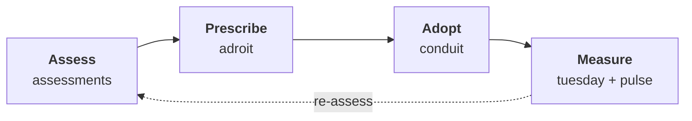

# The TAPS Portfolio — Tools, Apps, Products, and Services

## Modernization with the seams closed

Most modernization programs break at the seams. The assessment dies in a
PowerPoint. The prescriptions rot in a wiki nobody trusts. Adoption is
unmeasured. Outcomes are invisible six months later — right when the CFO
asks what the spend bought. The problem isn't that any single step is done
badly. It's that the thread from *where are we?* to *is it working?* gets
dropped between artifacts and teams.

Como Technologies builds and operates a portfolio of **Tools, Apps,
Products, and Services** — the TAPS portfolio — designed to keep that
thread intact. We focus on two related domains: **software engineering
practice** and the **application platforms** workloads run on
(virtualization, containers, Kubernetes, cloud, serverless).

## The loop

A Como engagement runs a closed four-stage loop. Each stage has a
purpose-built tool, each stage's output is the next stage's input, and the
last stage feeds the first — because modernization is a cycle, not a
project.

1. **[Assess](./loop/assess.md)** — structured interviews become a
   schema-validated maturity assessment, not a deck.
2. **[Prescribe](./loop/prescribe.md)** — the assessment seeds a knowledge
   base of decisions and guidance your team actually accepts.
3. **[Adopt](./loop/adopt.md)** — accepted decisions become reviewable
   pull requests in your own forge, with humans holding every gate.
4. **[Measure](./loop/measure.md)** — capacity and sentiment data show
   what each decision cost and how it landed, feeding the next assessment.

Under all four stages sits one substrate:
[the knowledge base](./knowledge-base.md). Every artifact the loop
produces lives there as typed, validated, machine-readable pages — which
is why the thread never gets dropped between stages.

## How we work

**Opinionated, not dogmatic.** We ship defaults because most organizations
need a jumpstart — a fresh knowledge base starts from
[working content](./starter-content.md), not a blank page — and every
piece is built for bring-your-own when you already have your own shape.

**AI as leverage, not theater.** An assistant helps at every stage — in
the interview, at the keyboard, behind the pull request — and every AI
step lands behind a mechanical validation gate and a human decision. You
never have to trust a model; you review its work the way you already
review your team's.

## The portfolio at a glance

| Offering | What it is | Loop stage |
|---|---|---|
| [assessments](./loop/assess.md) | AI-assisted maturity assessments | Assess |
| [adroit](./loop/prescribe.md) | Decision authoring and management | Prescribe |
| [The knowledge base](./knowledge-base.md) | The shared substrate | every stage |
| [Starter content](./starter-content.md) | Day-one knowledge base content | every stage |
| [conduit](./loop/adopt.md) | Agentic delivery engine | Adopt |
| [tuesday](./loop/measure.md) | Capacity measurement | Measure |
| [pulse](./loop/measure.md) | Anonymous sentiment | Measure |
| [Services](./services.md) | The engagement layer | every stage |
